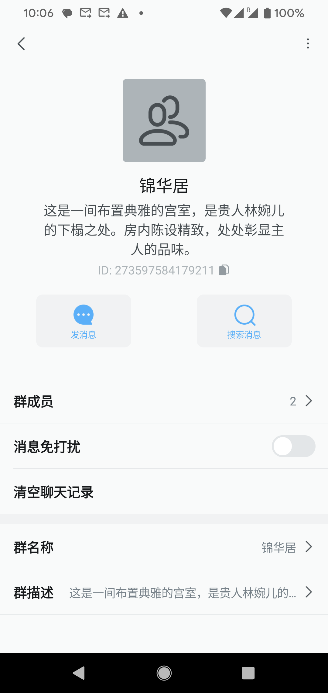
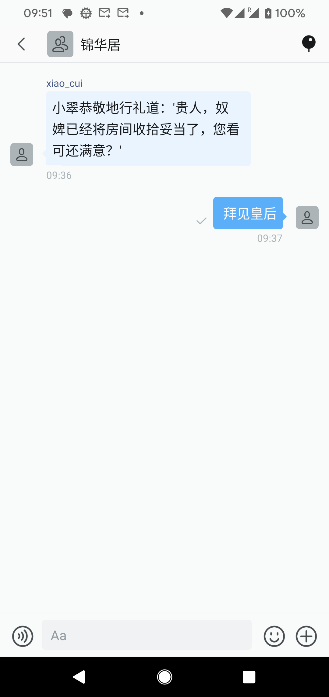
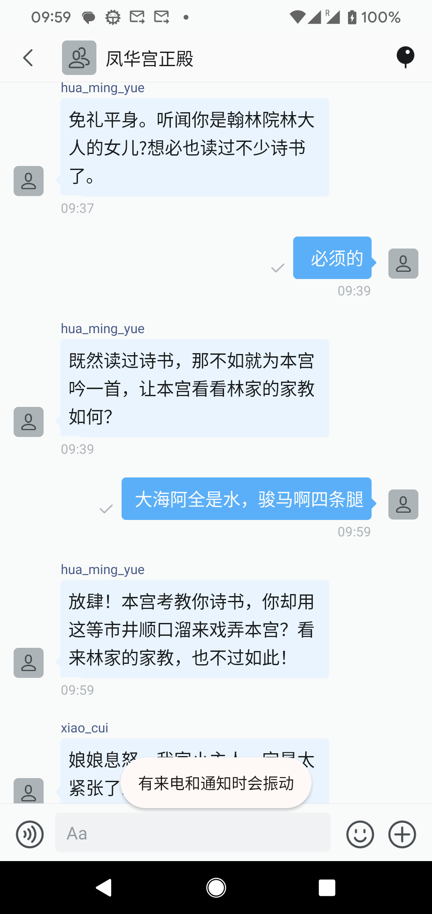
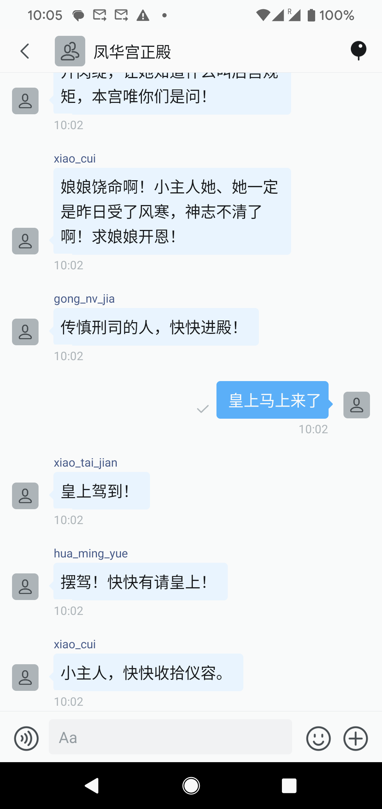
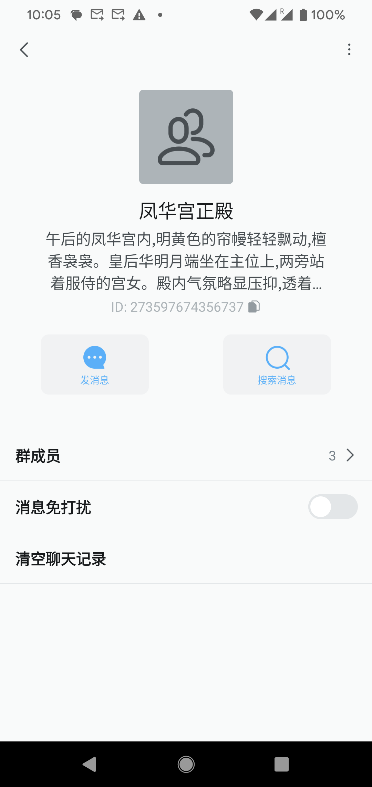
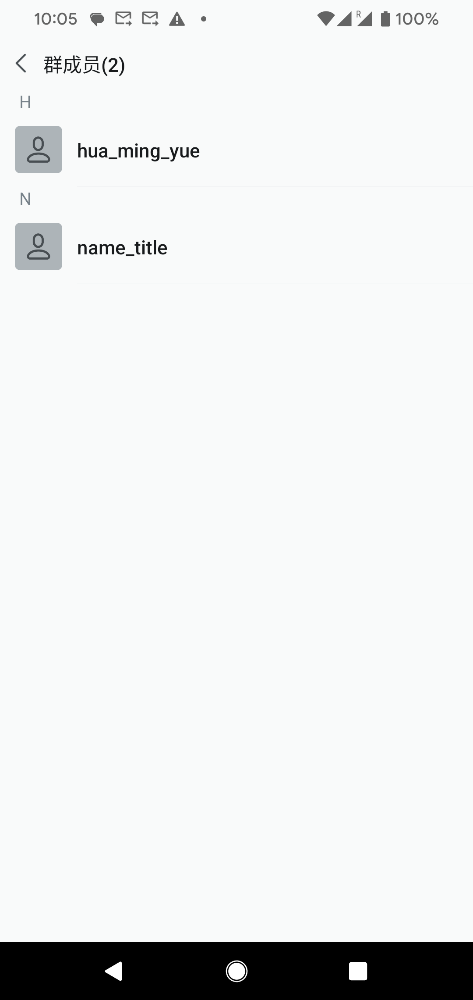

## AI宫斗

一句话：基于环信的用户、群聊接口构建一个AI驱动的宫斗游戏

其中所有的角色对标环信的用户，角色们所发生的场景对标环信的群聊

角色和场景都是实时基于AI大模型生成，并调用环信Restful api创建

举例1: 初始玩家以贵人的身份会开始游戏，此时创建群聊“锦小居”，创建用户“小翠”，玩家可以在该群聊里输入想说的话或者做到事情

举例2: 玩家可以输入任何想做到事情和想说的话，比如玩家输入“去拜见皇后娘娘”，此时系统会自动拉一个新的群，随机创建一些符合宫斗后续剧情的人物和背景故事，同时把所有的内容拉到一个新的群聊里“凤华宫正殿”，此时用户可以继续进行会话或执行动作，总体目标是在宫斗中立足并获胜。

举例3: 系统还结合了环信更多的接口能力，比如当一些NPC在场景中离开系统也会自动把他们从群聊中移除，比如“皇上驾到了”，导致整个群聊里人都出去了，都去接驾了

举例4: 用户也可以随着剧情的推进加NPC好友，至于NPC是否通过好友申请需要看每个NPC背后的AI对用户的好感度了。同时系统也利用用户封禁的接口，实现了对玩家或NPC打入冷宫，增加了游戏的趣味性

总结：

该项目采用AI Agent实现了AI构建宫斗剧情的实时推进，随着不同用户不同的输入产生不同的剧情，将游戏中的角色与环信用户的概念对应，将游戏中的场景与环信中的群聊对应，让玩家在聊天中模糊了真实虚拟的边界，代入感极强，同时无限的结局也具备很强可玩性。