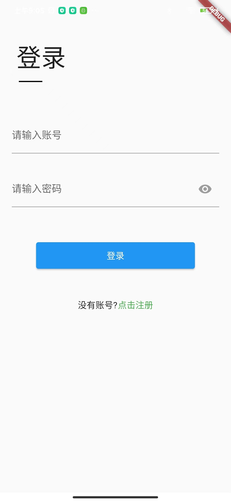
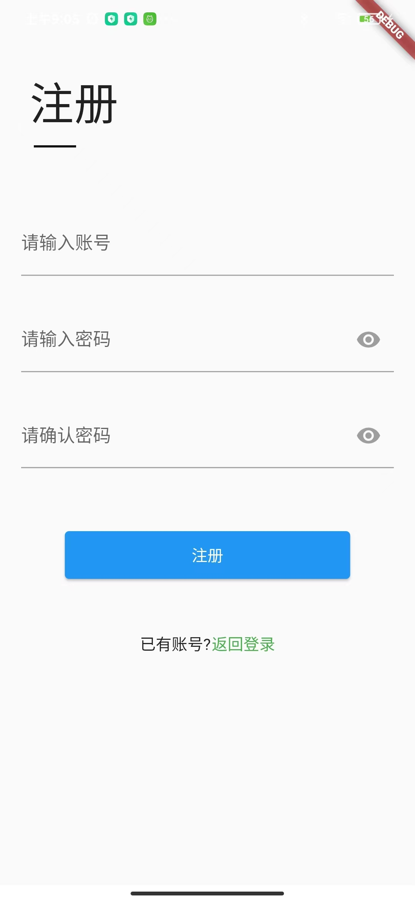
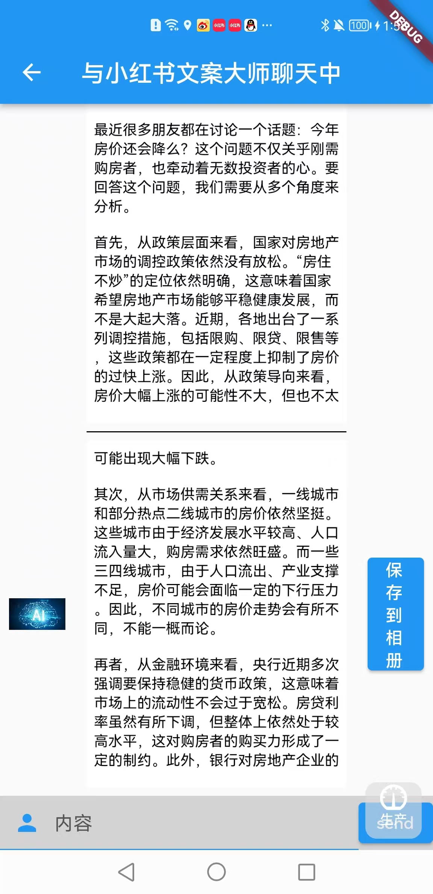
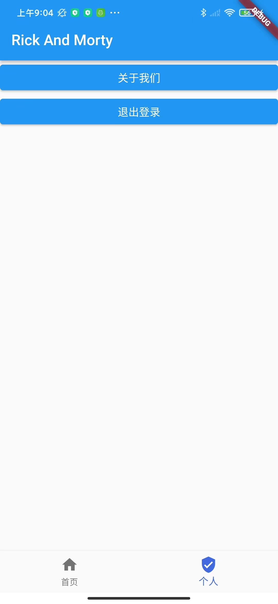
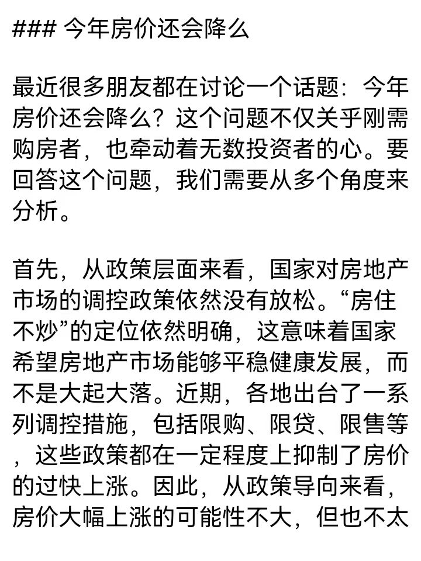
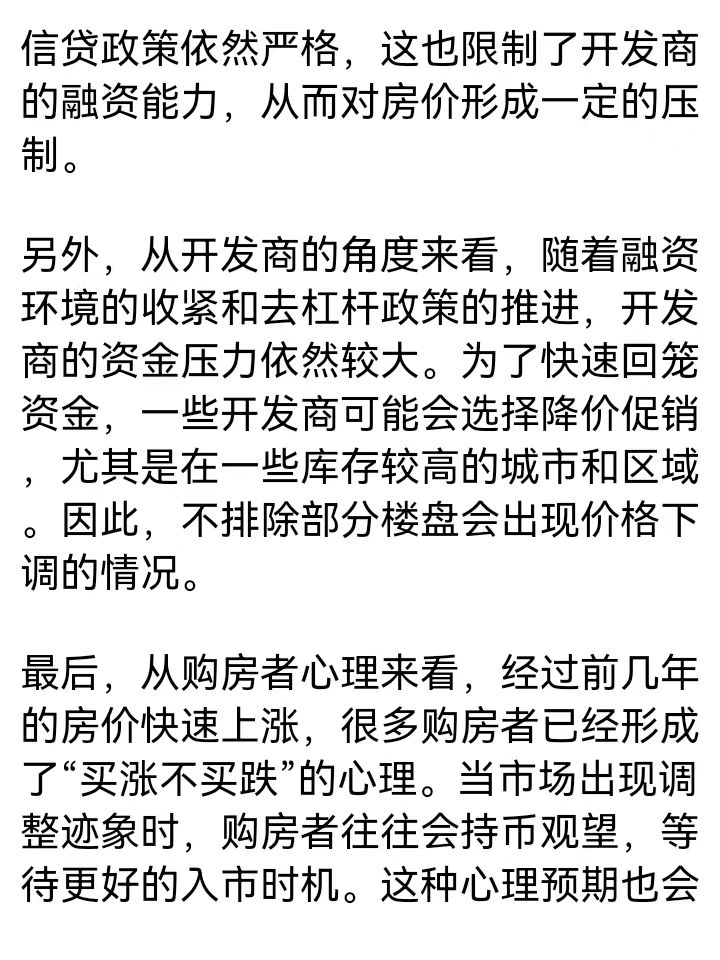
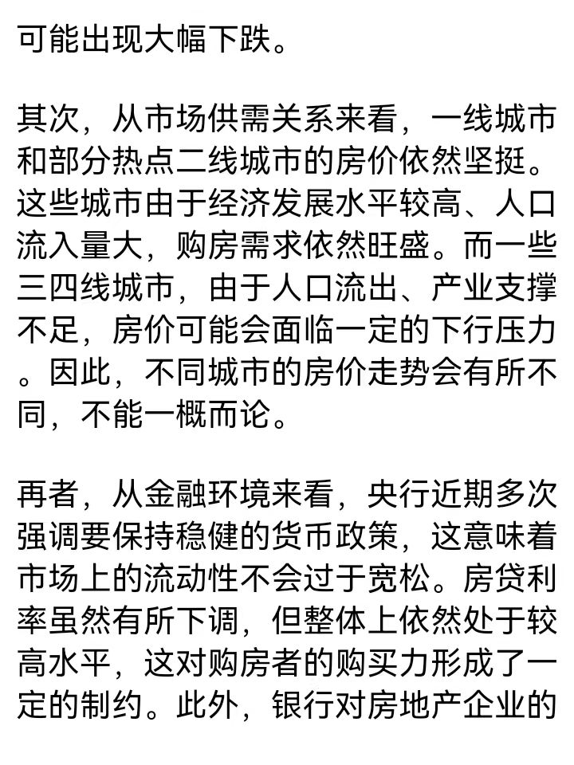
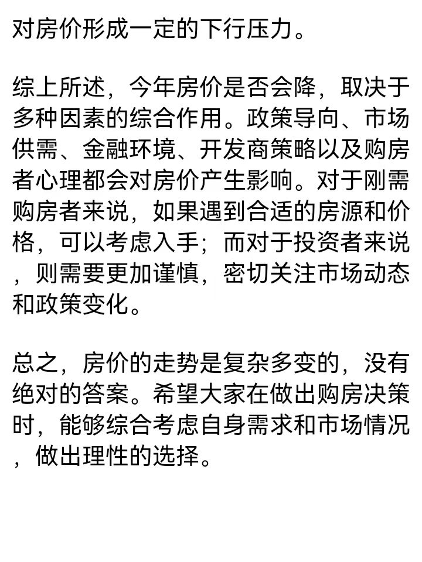
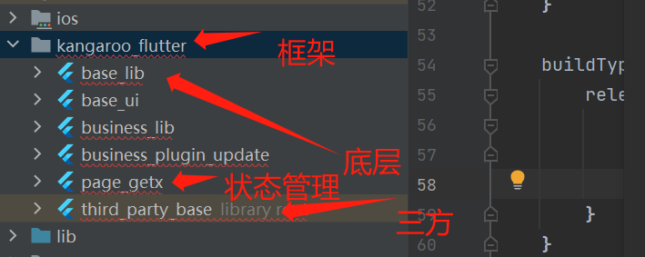
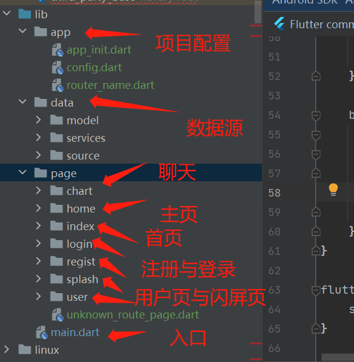

# Ai 分析助手 

## 通过对话的形式，生成小红书图片文案（顺带图片切片）。
----

开发环境：
- Tools : Android Studio giraffe
- os : windows 11
- code : dart & flutter

运行环境：

- os : Android 5.0 +

项目包含内容：

- Android project
- 安装包

第三方：

- 环信IM sdk
- minmax AI接口

## 项目背景

该项目通过ai生成的文案，通过一些算法，再通过图片切片的方式，生成小红书图片文案。
该项目弥补了ai只能生成文案，无法生成图片文案，所以需要通过算法，再通过图片切片的方式，生成小红书图片文案。

## 运行说明
本项目登录功能全部采用环信sdk提供的登录功能呢。
由于本项目没有后台，很多功能和数据都是在本地做的处理

安装包：[安装包](安装包/app-debug.apk)

# 登录页面

登陆页面，采用环信im服务

# 注册页面

注册页面，采用环信im服务

# 聊天列表界面

本项目目前只有小红书文案聊天

# 聊天页面

# 用户界面

# 文案生成效果

# 代码展示

本项目采用跨平台语言 flutter & dart 开发
架构采用 getx

# 基础框架

# 页面结构

