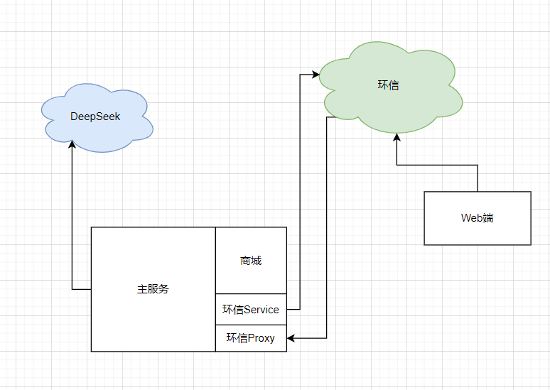
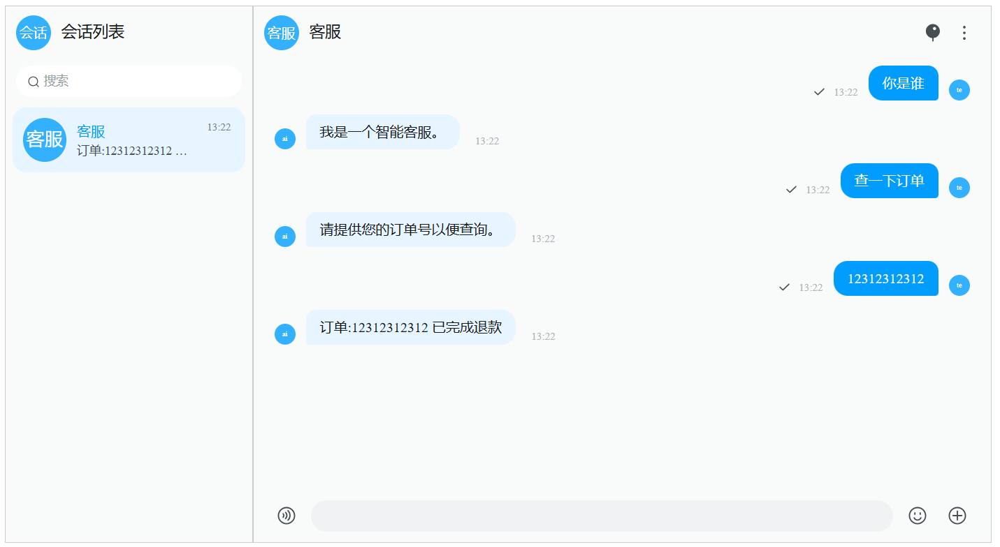

# 杨杨代表队 - 智能客服

## 项目简介

智能客服项目。语义分析依赖DeepSeek，后端接入商城模块，用于查询订单信息。通信使用环信完成。

## 整体架构



- DeepSeek：语义分析
- 商城：模拟查询订单信息
- 环信Service：服务端主动发送消息
- 环信Proxy：环信代理 (主要用于消息转发)
- 前端: 面向用户 (基于环信Web UIKit实现)

## 项目启动

### 后端

以Python为主

需要先根据`requirements.txt`安装依赖，推荐使用`virtualenv`。

- 启动环信Proxy 
  - `python easemob_proxy/easemob_proxy_srv.py`

- 启动主服务
  - `python main.py`

### 前端

基于`Vite React TS`项目。

```shell
pnpm install
pnpm run dev
```

## 截图



## 延伸

目前`DeepSeek`的使用，通过API + Prompt方式，对于客服的专业性感觉并不是很足。后续如果可以进行如LoRA等微调，会使模型更加的可靠和智能。